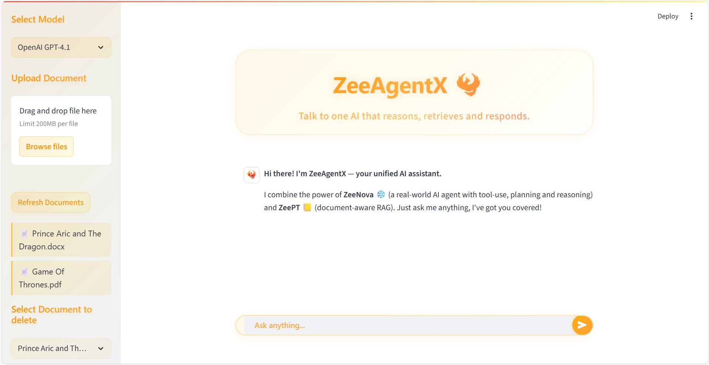
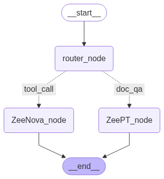

# ZeeAgentX 🐦‍🔥

ZeeAgentX is a hybrid **GenAI assistant** that combines the power of **Tool-Augmented Agents** (ZeeNova) with **Retrieval-Augmented Generation (RAG)** (ZeePT) to answer both real-time and document-specific queries intelligently.

> 🔁 Combines RAG + Tool-Based Reasoning · Powered by LangChain & LangGraph · Streamlit + FastAPI App



---

## 🚀 Why ZeeAgentX?

Most GenAI systems today are either:
- 🔍 **RAG chatbots** — good with documents, bad with real-time info.
- 🤖 **Tool Agents** — great with APIs, but lack memory or context.

**ZeeAgentX blends the best of both.**  
It's built to intelligently **route each query** to the correct engine whether it requires:
- 🌐 Live tools (e.g. stock, weather, Google search, train PNR, recharge plans, etc)
- 📄 Custom document Q&A (PDF, DOCX, HTML)

Whether you want to ask *“Check Tesla’s stock”* or *“Summarize this 50-page offer letter”*, ZeeAgentX handles both.

---

## ✨ Key Features

- ✅ **Hybrid AI System** (RAG + Agent)
- 🧠 **Intelligent Routing** using LangGraph
- 🧩 Modular tool registry (15+ live tools)
- 📄 Upload & query your documents (Chroma + RAG)
- 💬 Conversational memory for agent-based interactions
- ⚙️ Unified FastAPI + Streamlit interface

---

## 🔄 ZeeAgentX Flow
 



Each query is intelligently classified by a LLM to route between:
- `agent` → tool-based logic (ZeeNova)
- `rag` → document-based retrieval (ZeePT)

---

## 🛠️ Available Tools (ZeeNova Agent)

| Tool                      | Description                                                                 |
|---------------------------|-----------------------------------------------------------------------------|
| 🕒 **Time**                | Get the current time                                                       |
| 📚 **Wikipedia**           | Look up general knowledge, people, or concepts                            |
| 🔍 **Google Search**       | Search the web for news, facts, or updates                                 |
| 📈 **Stock Price Checker** | Real-time stock prices using ticker symbols                                |
| 🌦️ **Weather**             | Check current weather by city or IP                                        |
| 💱 **Currency Converter**  | Convert between currencies in real-time                                     |
| 📺 **YouTube Search**      | Search latest videos for a topic/person                                    |
| 🛍️ **E-commerce Search**   | Get real product listings from Amazon/Flipkart                            |
| 🇮🇳 **Indian Holiday API**  | Check public holidays in India                                              |
| 🚆 **Train Live Status**   | Get live running status of Indian trains                                   |
| 🧾 **PNR Checker**         | Get PNR status using 10-digit PNR                                          |
| ✈️ **Flight Status**       | Live flight status using IATA codes                                        |
| 🏦 **FD Rates Checker**    | Scrape latest FD interest rates                                            |
| 📲 **Recharge Plans**      | Get current prepaid plans for Airtel, Jio, Vi                              |

---

## 🧠 How ZeeAgentX Is Better

| Feature                     | Traditional RAG Chatbot             | ZeeAgentX (Hybrid AI)                     |
|-----------------------------|-------------------------------------|-------------------------------------------|
| ⚙️ Tool Usage                | ❌ No                                | ✅ Yes (intelligent tool calls)            |
| 📄 Doc Upload                | ✅ Yes                               | ✅ Yes                                     |
| 🔍 Real-time Web Search      | ❌ No                                | ✅ Google Search + APIs                    |
| 🤔 Routing Capability        | ❌ Static                            | ✅ Dynamic (LangGraph + LLM router)        |
| 🧠 Memory                    | ❌ No or limited                     | ✅ Yes (agent-side memory buffer)          |
| 🧩 Flexibility               | ❌ Domain-locked                     | ✅ General-purpose, multi-domain           |

---

## 🧰 Tech Stack

| Category             | Library / Tool                     | Description                                  |
|----------------------|------------------------------------|----------------------------------------------|
| 🧠 LLM Framework      | `LangChain`, `LangGraph`           | RAG + Agent orchestration and state flow     |
| ⚙️ Backend            | `FastAPI`                          | API layer for chat, docs, history             |
| 🖥️ Frontend           | `Streamlit`                        | Interactive chat UI                          |
| 📚 RAG Stack          | `ChromaDB`, `docx2txt`, `PyMuPDF`  | Vector store + doc loaders                   |
| 🌐 APIs & Search      | `SerpAPI`, `RapidAPI`, `BS4`       | Google search, IRCTC, Aviation, scraping     |
| 💾 DB & Storage       | `SQLite`, `uuid`, `os`, `shutil`   | Lightweight local storage                    |

---

## 🚀 Getting Started

### 🔗 Option 1: [Try on HuggingFace Spaces](https://huggingface.co/spaces/MrFaiz07/ZeeAgentX)

No installation needed. Launch it online instantly.

---

### 💻 Option 2: Run Locally

#### 1. Clone the repo

```bash
git clone https://github.com/Zeeshan-Faiz/ZeeAgentX
cd ZeeAgentX
```

#### 2. Create a virtual environment

```bash
python -m venv venv
source venv/bin/activate
# Windows: venv\Scripts\activate
```

#### 3. Install dependencies

```bash
pip install -r requirements.txt
```

#### 4. Setup Environment
Create a .env file in root with the following:

```bash
GITHUB_TOKEN=your_github_model_token
SERPAPI_API_KEY=your_serpapi_key
RAPIDAPI_KEY=your_rapidapi_key
```

#### 5. Start the Backend (FastAPI)

```bash
uvicorn backend.api.main:app --reload
```

#### 6. Start the Frontend (Streamlit)

```bash
streamlit run frontend/streamlit_app.py
```

## 💡 Example Queries to Try

- “What’s the weather in Bangalore?”
- “Search YouTube for iPhone 15 review”
- “Check live status of train 12951”
- “Is 26th January a holiday in India?”
- “Summarize this PDF offer letter”
- “Give me latest FD interest rates from ICICI”
- “What are Jio recharge plans under ₹300?”

## 📂 Project Structure

```
ZeeAgentX/
├── backend/
│   ├── api/
│   │   ├── main.py
│   │   ├── routes/
│   │   │   ├── chat.py
│   │   │   ├── documents.py
│   │   └── schemas/
│   │       ├── chat_models.py
│   │       ├── doc_models.py
│   │       └── response_models.py
│   ├── services/
│   │   ├── agent_workflow/          # ZeeNova: Tool Agent
│   │   │   ├── agent_executor.py
│   │   │   ├── tool_registry.py
│   │   │   ├── models/
│   │   │   ├── tool_functions/
│   │   │   └── chains/
│   │   ├── rag_pipeline/            # ZeePT: RAG Chatbot
│   │   │   ├── rag_executor.py
│   │   │   ├── chroma_utils.py
│   │   │   ├── models/
│   │   │   └── chains/
│   │   └── langgraph/               # LangGraph logic
│   │       ├── flow_builder.py
│   │       ├── router_node.py
│   │       └── state_model.py
│   ├── utils/
│   │   ├── db_utils.py
│
├── frontend/
│   ├── components/
│   │   ├── chat_ui.py
│   │   ├── sidebar.py
│   ├── utils/
│   │   └── api_utils.py
│   └── streamlit_app.py
├── .env
├── requirements.txt
├── README.md
```
